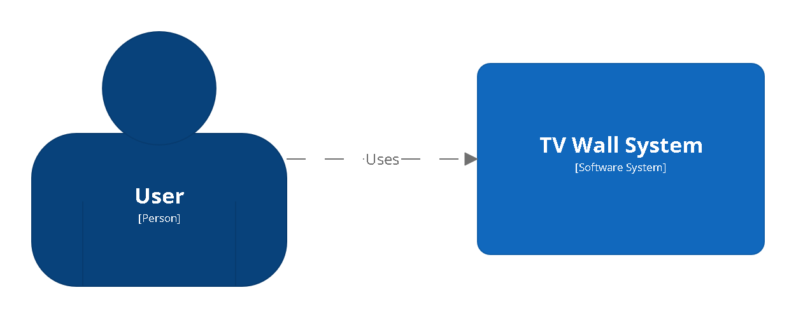
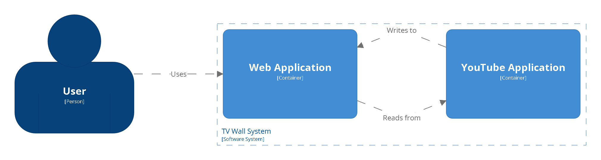

Contents
---
1	[TLDR](#tldr)  
2	[Author](#author)  
3	[Structurizr Diagram](#structurizr-diagram)  
4	[Origin](#origin)  
5	[Instructions](#instructions)  
6	[References](#references)  

TLDR
---
TVWall.cc http://tvwall.cc[1] - discovering your favorite YouTube videos with ease

Author
---
Johann Li

`LINKEDIN` https://www.linkedin.com/in/johannwpli/

`GITHUB` https://github.com/johannwpli/

`WEBSITE` https://johann.li/

Structurizr Diagram
---
Structurizr builds upon "diagrams as code", allowing you to create multiple software architecture diagrams from a single model[2].  
  
Structurizr System Context  
  
  
Structurizr System Context Key  
  
  
Structurizr Container  
  
  
Structurizr Container Key  
  

Origin
---
TV Wall inspired by the [反送中直播台 No China Extradition Live](https://ncehk2019.github.io/) project[3] (stops running), which live-streamed Hong Kong in 2019. Wars never end and are always nearby. Taiwanese fought against the government in 2014, while Thailand people and Belarusian in 2020, Myanmar and Iran in 2021, and China in 2022. Besides, Battles between countries such as Russia and Ukraine have continued and lasted. The conflict since 2014 even saw a significant escalation in February 2022 as Russia launched a full-scale invasion of Ukraine. However, Earth citizens who pursue democracy will continue to stand together and fight for freedom.

Instructions
---
`COMPATIBILITY` TV Wall supports multi browsers and devices[4], including mobiles, tablets, laptops, and desktops.

`HIDDEN MENUS` Use 'm' as the menu param to show hidden menus, e.g., http://tvwall.cc/?m=IU, to show IU videos.

`CUSTOM IDS` Use 'i' as the id param to customize your video list[5], e.g., http://tvwall.cc/?i=kJQP7kiw5Fk,JGwWNGJdvx8, to build your video list with these 2 YouTube video IDs.

`VIDEO NUMBERS` Use 'g' as the grid param to play a specific number of or all videos, e.g., http://tvwall.cc/?g=all, to play all the videos.

`DISPLAY LANGUAGE` Use 'l' as the language param to set the display language, e.g., http://tvwall.cc/?l=jp, to set Japanese as the display language.

`THEATER MODE` Use the drop-down menu[6] to watch the video in theater mode., e.g., select 1 to watch the top left video.

`HOTKEY` Press the keyboard to trigger the hotkey to the theater mode., e.g., press 0 to activate the '0' of theater mode.

References
---
1. Redirects to https://johannwpli.github.io/tv-wall/.  
2. Read more at https://structurizr.org/ and https://c4model.com/.  
3. Hosted from https://github.com/ncehk2019/ncehk2019.github.io.  
4. The default number of videos on mobiles is 3, on tablets is 6, on laptop is 9, and on desktops is 12.  
5. Place YouTube video IDs separated by a comma.  
6. The number of the top left video is 1, then 2, and so on, from left to right, top to down.